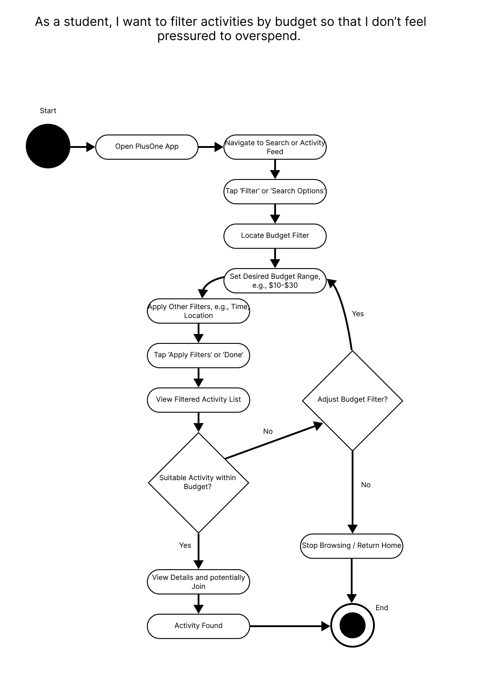
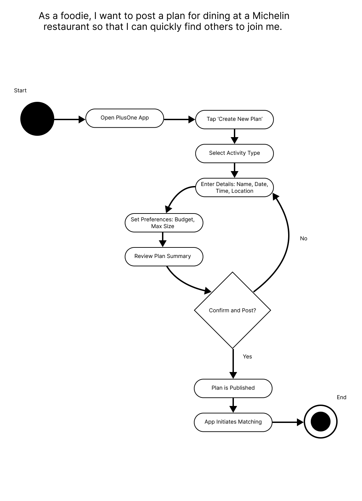
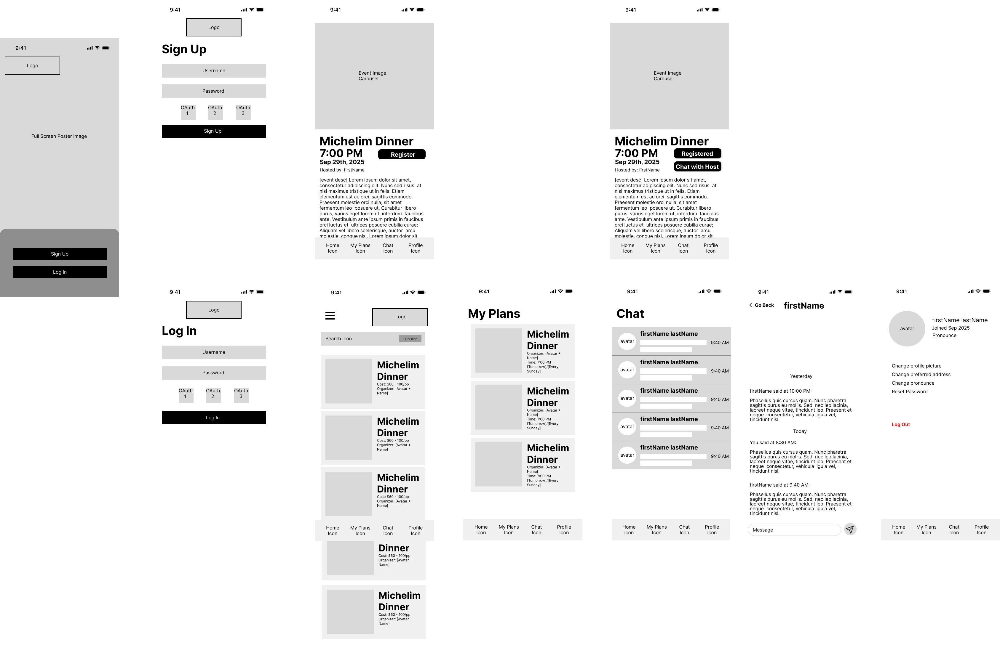

# Specification Phase Exercise

A little exercise to get started with the specification phase of the software development lifecycle. See the [instructions](instructions.md) for more detail.

## Team members

`jl13869` Jason Liu ([jsl1114](https://github.com/jsl1114))  
`jc11462` Jack Chen ([a247686991](https://github.com/a247686991))  
`yl9778` Krystal Lin ([SnazzyBeatle115](https://github.com/SnazzyBeatle115))  
`bh2514` Natalie Han ([nateisnataliehan](https://github.com/nateisnataliehan))  
`ag8969` Angela Gao ([Xuan4781](https://github.com/Xuan4781))  

## Stakeholders

Stakeholder Profile

**Pseudonym**: Viola, 21 years old

**Role**: International student in New York City

**Context**: Loves trying new restaurants, group fitness classes, and cultural events but often struggles to find friends who are free at the same time.

**Tech habits**: Heavy user of social media (Red, WeChat), comfortable with mobile apps and mobile payments.

**Goals / Needs**
- Be able to quickly find reliable partners for spontaneous activities such as dining, fitness, or any outings.
- Match with people based on shared schedule, budget, and location to reduce friction.
Feel safe by verifying the identity of companions and checking past ratings or reviews.
Use an app that minimizes coordination effort by automatically generating meeting details and group chats.

**Frustrations / Problems**

- Friends are often busy or unavailable, so many of her plans never happen.
- Posting “looking for a partner” messages on social media is inefficient and sometimes awkward.
- Mismatched budgets, preferences, or locations make it hard to find companions.
- Feels anxious about the possibility of strangers being unreliable, unsafe, or not showing up.

**Interview Notes**

“Last week I really wanted to try a Michelin restaurant, but all my close friends had exams, so I ended up canceling.”

“I don’t feel comfortable just meeting random people from public groups unless I can see some verification.”

“Even when someone says they will come, sometimes they cancel last minute, which ruins the whole plan.”

## Product Vision Statement

For young people in New York who often struggle to find companions for plans, **PlusOne** is a mobile app that quickly and safely pairs them with reliable pals so their spontaneous plans can become real experiences.

## User Requirements

- As a **foodie**, I want to post a plan for dining at a Michelin restaurant so that I can quickly find others to join me.
- As a **student**, I want to filter activities by budget so that I don’t feel pressured to overspend.
- As a **fitness beginner**, I want to find partners at the same experience level so that I don’t feel intimidated in class.
- As a **woman user**, I want the option to restrict activities to women-only so that I feel safer.
- As a **spontaneous person**, I want to see activities happening tonight near me so that I can join last minute.
- As an **organizer**, I want to set a maximum group size so that the event remains manageable.
- As a **safety-conscious user**, I want to see verification and ratings before joining so that I can trust who I meet.
- As a **busy professional**, I want automatic reminders before the event so that I don’t forget to show up.
- As a **joiner**, I want to receive the meeting point automatically so that I don’t waste time coordinating.
- As a **commuter**, I want to filter activities by subway line so that travel is convenient.
- As a **frequent user**, I want to save templates for recurring activities (e.g., weekly yoga) so that posting is faster.
- As a **community member**, I want to report no-shows or unsafe behavior so that the platform stays reliable.

## Activity Diagrams

## Clickable Prototype

Live [here](https://www.figma.com/proto/uPbYvMBB8eeFcusUa9W46M/SWE-Group?node-id=1-46&t=sJfeGKN0lei3PDFN-1&scaling=scale-down&content-scaling=fixed&page-id=0%3A1&starting-point-node-id=1%3A46)
